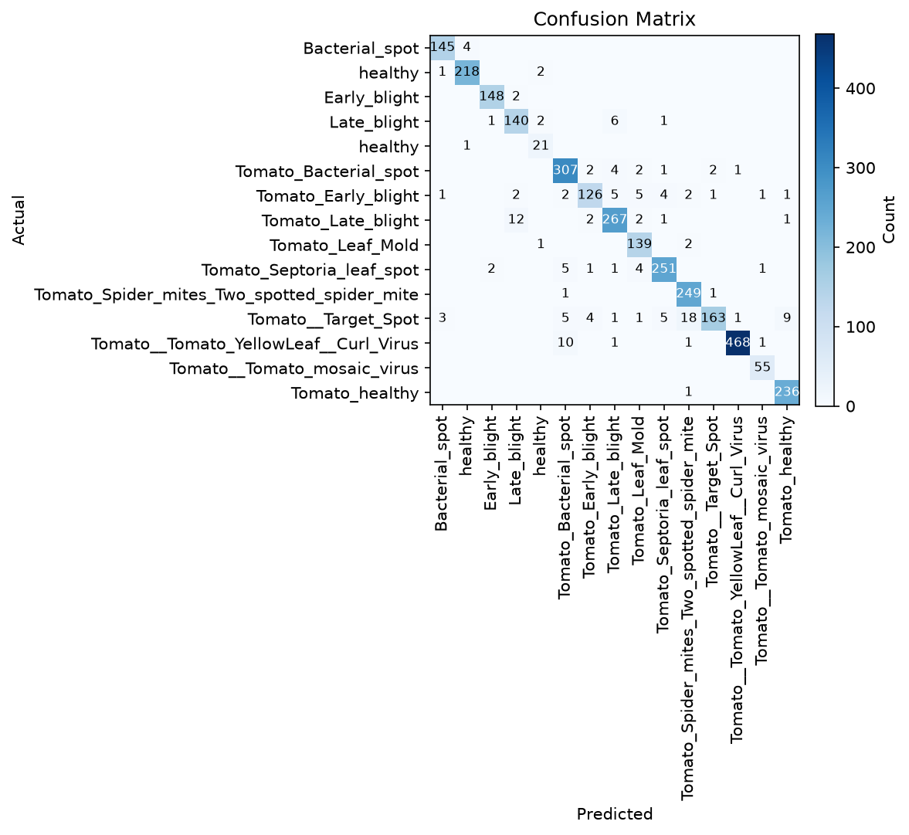

# Model Evaluation Report

- Checkpoint: `weights/best_model.pth`
- Macro-F1 (**primary**): `0.9422`
- Accuracy (secondary): `0.9501`
- Number of classes: `15`

## Per-class metrics

| Class | Precision | Recall | F1 | Support |
|---|---|---|---|---|
| Pepper__bell___Bacterial_spot | 0.9667 | 0.9732 | 0.9699 | 149 |
| Pepper__bell___healthy | 0.9776 | 0.9864 | 0.9820 | 221 |
| Potato___Early_blight | 0.9801 | 0.9867 | 0.9834 | 150 |
| Potato___Late_blight | 0.8974 | 0.9333 | 0.9150 | 150 |
| Potato___healthy | 0.8077 | 0.9545 | 0.8750 | 22 |
| Tomato_Bacterial_spot | 0.9303 | 0.9624 | 0.9461 | 319 |
| Tomato_Early_blight | 0.9333 | 0.8400 | 0.8842 | 150 |
| Tomato_Late_blight | 0.9368 | 0.9368 | 0.9368 | 285 |
| Tomato_Leaf_Mold | 0.9085 | 0.9789 | 0.9424 | 142 |
| Tomato_Septoria_leaf_spot | 0.9544 | 0.9472 | 0.9508 | 265 |
| Tomato_Spider_mites_Two_spotted_spider_mite | 0.9121 | 0.9920 | 0.9504 | 251 |
| Tomato__Target_Spot | 0.9760 | 0.7762 | 0.8647 | 210 |
| Tomato__Tomato_YellowLeaf__Curl_Virus | 0.9957 | 0.9730 | 0.9842 | 481 |
| Tomato__Tomato_mosaic_virus | 0.9483 | 1.0000 | 0.9735 | 55 |
| Tomato_healthy | 0.9555 | 0.9958 | 0.9752 | 237 |

## Confusion matrix



## Checkpoint metadata

```json
{
  "experiment_id": "final_004",
  "experiment_name": "Fine-tuned EfficientNet-B0 (full finetune, warmup+cosine, mixup/erasing, balanced sampling)",
  "model_name": "tf_efficientnet_b0",
  "num_classes": 15,
  "class_names": [
    "Pepper__bell___Bacterial_spot",
    "Pepper__bell___healthy",
    "Potato___Early_blight",
    "Potato___Late_blight",
    "Potato___healthy",
    "Tomato_Bacterial_spot",
    "Tomato_Early_blight",
    "Tomato_Late_blight",
    "Tomato_Leaf_Mold",
    "Tomato_Septoria_leaf_spot",
    "Tomato_Spider_mites_Two_spotted_spider_mite",
    "Tomato__Target_Spot",
    "Tomato__Tomato_YellowLeaf__Curl_Virus",
    "Tomato__Tomato_mosaic_virus",
    "Tomato_healthy"
  ],
  "image_size": 224,
  "augmentation": "mild",
  "erasing": 0.2,
  "mixup_alpha": 0.2,
  "balanced_sampling": true,
  "seed": 42,
  "epochs": 12,
  "warmup_epochs": 2,
  "batch_size": 16,
  "optimizer": "AdamW",
  "learning_rate": 0.0001,
  "weight_decay": 0.0001,
  "scheduler": "warmup_cosine",
  "loss": "CrossEntropyLoss",
  "focal_gamma": 2.0,
  "label_smoothing": 0.1,
  "stage": "finetune",
  "freeze_backbone": false,
  "unfreeze_from_layer": "blocks.0",
  "use_amp": false,
  "device": "cuda",
  "best_epoch": 12,
  "validation_macro_f1": 0.9422363487799942,
  "validation_accuracy": 0.9501133786848073,
  "history": [
    {
      "epoch": 1,
      "loss": 2.601949243226861,
      "accuracy": 0.14261276158978162,
      "macro_f1": 0.14269345945458392,
      "macro_precision": 0.14527611221698808,
      "macro_recall": 0.14215031647848805,
      "lr": 1e-05,
      "duration_s": 936.3049502372742,
      "val_epoch": 1,
      "val_accuracy": 0.4661483641075478,
      "val_macro_f1": 0.4128820171244885,
      "val_macro_precision": 0.42535709733956834,
      "val_macro_recall": 0.46397864019152146,
      "val_lr": 1e-05,
      "val_duration_s": 42.00067758560181,
      "val_loss": 1.9083886010615154
    },
    {
      "epoch": 2,
      "loss": 1.8673871288129893,
      "accuracy": 0.32833437874208815,
      "macro_f1": 0.32539945965463085,
      "macro_precision": 0.32486228088541175,
      "macro_recall": 0.32798873214630675,
      "lr": 9.755282581475769e-06,
      "duration_s": 910.355152130127,
      "val_epoch": 2,
      "val_accuracy": 0.7667638483965015,
      "val_macro_f1": 0.7236108208880404,
      "val_macro_precision": 0.7208161502456396,
      "val_macro_recall": 0.7669321214164848,
      "val_lr": 9.755282581475769e-06,
      "val_duration_s": 41.93134379386902,
      "val_loss": 1.2169923580770243
    },
    {
      "epoch": 3,
      "loss": 1.5330394421960456,
      "accuracy": 0.4066259907623881,
      "macro_f1": 0.40529215474156827,
      "macro_precision": 0.4050045978601154,
      "macro_recall": 0.40623080854060684,
      "lr": 9.045084971874738e-06,
      "duration_s": 910.8193428516388,
      "val_epoch": 3,
      "val_accuracy": 0.8665370910268869,
      "val_macro_f1": 0.84300059547711,
      "val_macro_precision": 0.8334321024139903,
      "val_macro_recall": 0.8656492197325201,
      "val_lr": 9.045084971874738e-06,
      "val_duration_s": 41.43826389312744,
      "val_loss": 0.9759237566618306
    },
    {
      "epoch": 4,
      "loss": 1.3986517536318641,
      "accuracy": 0.4423219478816217,
      "macro_f1": 0.4415929821552461,
      "macro_precision": 0.4415195880259611,
      "macro_recall": 0.44195257417472045,
      "lr": 7.938926261462366e-06,
      "duration_s": 918.4710531234741,
      "val_epoch": 4,
      "val_accuracy": 0.8814382896015549,
      "val_macro_f1": 0.865377614581026,
      "val_macro_precision": 0.8666920073410532,
      "val_macro_recall": 0.8767857664042646,
      "val_lr": 7.938926261462366e-06,
      "val_duration_s": 41.3101224899292,
      "val_loss": 0.9381961618228216
    },
    {
      "epoch": 5,
      "loss": 1.3543523378258537,
      "accuracy": 0.4748246564406683,
      "macro_f1": 0.4740751635085501,
      "macro_precision": 0.4738752315467495,
      "macro_recall": 0.4745677407220575,
      "lr": 6.545084971874738e-06,
      "duration_s": 909.2876608371735,
      "val_epoch": 5,
      "val_accuracy": 0.923226433430515,
      "val_macro_f1": 0.9085323304939996,
      "val_macro_precision": 0.9000661665428613,
      "val_macro_recall": 0.9230747433653523,
      "val_lr": 6.545084971874738e-06,
      "val_duration_s": 41.37489104270935,
      "val_loss": 0.8487669657378819
    },
    {
      "epoch": 6,
      "loss": 1.2969180616283182,
      "accuracy": 0.4605120602155443,
      "macro_f1": 0.45991205379620137,
      "macro_precision": 0.4597241831870662,
      "macro_recall": 0.4602961490683619,
      "lr": 5e-06,
      "duration_s": 908.6110696792603,
      "val_epoch": 6,
      "val_accuracy": 0.9284094590217039,
      "val_macro_f1": 0.9151155095254274,
      "val_macro_precision": 0.9126906426239553,
      "val_macro_recall": 0.9238314638236012,
      "val_lr": 5e-06,
      "val_duration_s": 41.050392389297485,
      "val_loss": 0.8371960257572536
    },
    {
      "epoch": 7,
      "loss": 1.269211042999317,
      "accuracy": 0.4943833038718139,
      "macro_f1": 0.49400513801159013,
      "macro_precision": 0.4938765305033375,
      "macro_recall": 0.4944001187107761,
      "lr": 3.4549150281252635e-06,
      "duration_s": 908.7036809921265,
      "val_epoch": 7,
      "val_accuracy": 0.9394233884029802,
      "val_macro_f1": 0.9314556859434044,
      "val_macro_precision": 0.9276438390065304,
      "val_macro_recall": 0.9389456095636433,
      "val_lr": 3.4549150281252635e-06,
      "val_duration_s": 41.04865574836731,
      "val_loss": 0.8084711409866289
    },
    {
      "epoch": 8,
      "loss": 1.2897639204038212,
      "accuracy": 0.4588584136397331,
      "macro_f1": 0.45848937037156784,
      "macro_precision": 0.45850136025389143,
      "macro_recall": 0.45860967609898917,
      "lr": 2.061073738537635e-06,
      "duration_s": 1362.4630346298218,
      "val_epoch": 8,
      "val_accuracy": 0.941367022999676,
      "val_macro_f1": 0.9302068778795541,
      "val_macro_precision": 0.9246816789038451,
      "val_macro_recall": 0.9398178392008596,
      "val_lr": 2.061073738537635e-06,
      "val_duration_s": 8.929197072982788,
      "val_loss": 0.8104251199530134
    },
    {
      "epoch": 9,
      "loss": 1.2488609634566255,
      "accuracy": 0.4980327307977419,
      "macro_f1": 0.4975037281251451,
      "macro_precision": 0.49736533475288563,
      "macro_recall": 0.4978321375938929,
      "lr": 1e-06,
      "duration_s": 169.33181834220886,
      "val_epoch": 9,
      "val_accuracy": 0.9394233884029802,
      "val_macro_f1": 0.9309850959735978,
      "val_macro_precision": 0.9266088152462066,
      "val_macro_recall": 0.9392906381013632,
      "val_lr": 1e-06,
      "val_duration_s": 9.613986015319824,
      "val_loss": 0.7956967160738051
    },
    {
      "epoch": 10,
      "loss": 1.2476263866733444,
      "accuracy": 0.5095512345327022,
      "macro_f1": 0.5094221584245339,
      "macro_precision": 0.509311437232583,
      "macro_recall": 0.5097133100693363,
      "lr": 1e-06,
      "duration_s": 168.5248589515686,
      "val_epoch": 10,
      "val_accuracy": 0.9439585357952704,
      "val_macro_f1": 0.9356237381631872,
      "val_macro_precision": 0.9325041938656742,
      "val_macro_recall": 0.9422947657433636,
      "val_lr": 1e-06,
      "val_duration_s": 9.53988003730774,
      "val_loss": 0.7915981418691795
    },
    {
      "epoch": 11,
      "loss": 1.2322432668422385,
      "accuracy": 0.4781889718880082,
      "macro_f1": 0.4780252033261986,
      "macro_precision": 0.4779307862611008,
      "macro_recall": 0.4783401058882617,
      "lr": 1e-06,
      "duration_s": 168.00904893875122,
      "val_epoch": 11,
      "val_accuracy": 0.9455782312925171,
      "val_macro_f1": 0.9402992393978968,
      "val_macro_precision": 0.9356008695756426,
      "val_macro_recall": 0.9473050374528803,
      "val_lr": 1e-06,
      "val_duration_s": 9.605235815048218,
      "val_loss": 0.7946749415488779
    },
    {
      "epoch": 12,
      "loss": 1.232702352400142,
      "accuracy": 0.48890916348292185,
      "macro_f1": 0.48871111668140205,
      "macro_precision": 0.4885874548826533,
      "macro_recall": 0.48896887753161933,
      "lr": 1e-06,
      "duration_s": 390.559246301651,
      "val_epoch": 12,
      "val_accuracy": 0.9501133786848073,
      "val_macro_f1": 0.9422363487799942,
      "val_macro_precision": 0.9386983712137483,
      "val_macro_recall": 0.9490912446586924,
      "val_lr": 1e-06,
      "val_duration_s": 9.511878967285156,
      "val_loss": 0.7736895550869026
    }
  ]
}
```
